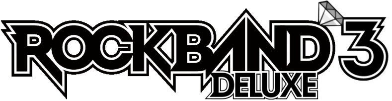

# Rock-Band-3-Deluxe

## Introduction

The purpose of this branch is to use an old version of Rock Band 3 Deluxe as a base and back-port any newer QoL features without any of the custom textures for stability on 360 hardware. Build specifically tailored for parties/events.

## Features

- Customizable track speed
- Customizable song speed 
- Vocal Options available on every instrument while in AIM
- Disable pausing for party play
- Calibration Mode
- Faster Menu scrolling
- Toggle Scrolling SFX
- Venue Select
- Gem color selector

### Settings turned on by default

- All Instruments Mode
- Venue set to big_club_02
- Mic Volumes set to 1
- Miss Sounds off
- Song Title always on
- Scroll SFX off
- Track Speed at 115%
- Larger hit-window

## Install

Setting up the Rock Band 3 Deluxe repo for the first time is meant to be as easy as possible.
As well, it is designed to allow you to automatically receive updates as the repo is updated.

Simply go to the Releases of this repo and grab all three files. (two .exe, one .bat, .sh for linux)

The two exe's are a couple dependencies, [Git for Windows](https://gitforwindows.org/), and [Dot Net 6.0 Runtime](https://dotnet.microsoft.com/en-us/download/dotnet/6.0/runtime).
Git is required for you to take advantage of auto updating via github pulls. Dot Net is required to build an ARK file, the archive format the game needs to run.
You can setup git with all default options, same with dot net.

Once the dependencies are installed, run "_init_repo.bat" in an **empty folder**. git will pull the repo and make sure you are completely up to date.

From then on simply run "_build_ps3.bat" or "_build_xbox.bat", depending on the platform you are building for. This script will pull the repo again for updates, and build the ARK for you and spit it out in _build/Xbox or _build/PS3

On ps3/rpcs3, copy all files in "_build/ps3/" to "/dev_hdd0/game/BLUS30463/"
Match the file system and overwrite the files.

On Xbox, copy the gen folder and the xex from "_build/xbox/" to the location you have installed Rock Band 3.
If installing for the first time, make sure you rename the vanilla "default.xex" to "default_vanilla.xex" for safety.
Also make sure to disable any enabled updates for Rock Band 3 in Aurora. Rock Band 3 deluxe rolls TU5 into its base installation.
If you are also running [RB3Enhanced](https://github.com/RBEnhanced/RB3Enhanced), grab the optional folders in "/_build/_optional-xbox-rb3e-rawfiles/" and place the "config" and "ui" folders next to the "gen" folder on your Xbox

Run the build script again to pull any new updates committed to the repo and rebuild a new ark.

## Included Dependencies

[Git for Windows](https://gitforwindows.org/) - CLI application to allow auto updating rb3dx repo files

[Dot Net 6.0 Runtime](https://dotnet.microsoft.com/en-us/download/dotnet/6.0/runtime) - Needed to run ArkHelper

[Mackiloha](https://github.com/PikminGuts92/Mackiloha) - ArkHelper for building Rock Band 3 ARK - Superfreq for building .bmp_xbox highway images

[dtab](https://github.com/mtolly/dtab) - For serializing Rock Band dtb files
